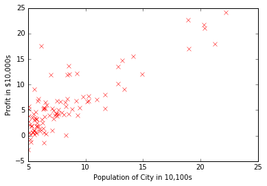
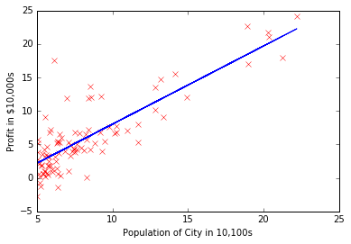
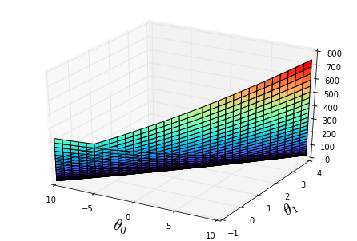
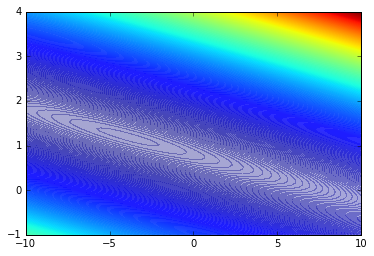
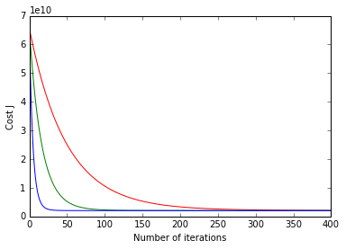

# Linear Regression with one variable


```python
%matplotlib inline
import matplotlib.pylab as plt
import numpy as np
```

    /Users/tinkle1129/anaconda/lib/python2.7/site-packages/matplotlib/font_manager.py:273: UserWarning: Matplotlib is building the font cache using fc-list. This may take a moment.
      warnings.warn('Matplotlib is building the font cache using fc-list. This may take a moment.')


```python
#Load data
data = np.loadtxt('ex1data1.txt',delimiter=',') #read comma separated data
x=data[:,0];y=data[:,1]
m=len(y)  # number of training examples
```


```python
plt.plot(x,y,'rx')  #plot the data
plt.ylabel('Profit in $10,000s') #Set the y-axis label
plt.xlabel('Population of City in 10,100s') #Set the x-axis label
```


    <matplotlib.text.Text at 0x10b4d24d0>





## Gradient Descent
### Cost Function
$$J(\theta)=\frac{1}{2m}\sum_{i=1}^{m}(h_{\theta}(x^{(i)})-y^{(i)})^2$$
where 
$$h_{\theta}=\theta^Tx=\theta_0+\theta_1x_1$$
In batch gradient descent, each iteration performs the update
$$\theta_j:=\theta_j-\alpha\frac{1}{m}\sum_{i=1}^{m}(h_{\theta}(x^{(i)})-y^{(i)})x_{j}^{(i)}$$


```python
X = np.c_[np.ones((m,1)),x.reshape(m,1)] #Add a column of ones
theta = np.zeros((2,1)) #Initialize fitting parameters

iterations = 1500
alpha = 0.01
```


```python
def computeCost(X,y,theta):
    def f(idx):
        return theta[0]+theta[1]*idx
    cost=np.array(map(lambda idx:f(idx),X[:,1])).reshape(len(y))
    return float(sum((y-cost)**2)/(len(y)*2))
computeCost(X,y,theta)
```


    32.072733877455654


```python
def gradientDescent(X, y, theta, alpha, iterations):
    def f(idx):
        return theta[0]+theta[1]*idx
    for i in range(iterations):
        cost=np.array(map(lambda idx:f(idx),X[:,1])).reshape(len(y))
        for j in range(len(theta)):
            theta[j]=theta[j]-alpha*1.0/len(y)*sum((cost-y)*X[:,j])
    return theta
        
theta0 = gradientDescent(X, y, theta, alpha, iterations)
print 'Theta found by gradient descent: %s  %s' %(theta[0],theta[1])
```

    Theta found by gradient descent: [-3.63029144]  [ 1.16636235]


```python
plt.plot(x,y,'rx')  #plot the data
plt.ylabel('Profit in $10,000s') #Set the y-axis label
plt.xlabel('Population of City in 10,100s') #Set the x-axis label
plt.plot(X[:,1],theta0[0]*X[:,0]+theta0[1]*X[:,1],'-')
```


    [<matplotlib.lines.Line2D at 0x10d9918d0>]





```python
theta0_vals = np.linspace(-10, 10, 100)
theta1_vals = np.linspace(-1, 4, 100)
J_vals = np.zeros((len(theta0_vals), len(theta1_vals)))
for i in range(len(theta0_vals)):
    for j in range(len(theta1_vals)):
        t = np.array([theta0_vals[i], theta1_vals[j]]).reshape((2,1))  
        J_vals[i][j] = computeCost(X, y, t);
```


```python
from mpl_toolkits.mplot3d import Axes3D
fig = plt.figure()
ax = Axes3D(fig)
J_vals=J_vals.transpose()
ax.plot_surface(theta0_vals, theta1_vals, J_vals,rstride=3, cstride=3, cmap='rainbow')
plt.xlabel(r'${\theta}_0$',fontsize=20)
plt.ylabel(r'${\theta}_1$',fontsize=20)
```


    <matplotlib.text.Text at 0x10e513750>





```python
plt.contourf(theta0_vals, theta1_vals, J_vals, 1000, alpha=.35, cmap='jet') #Contour plot
```


    <matplotlib.contour.QuadContourSet at 0x112008b90>





# Linear Regression with Multiple variable


```python
data = np.loadtxt('ex1data2.txt',delimiter=',') #read comma separated data
x=data[:,0:2];y=data[:,2]
m=len(y)  # number of training examples
```


```python
# Print out some data points
print 'First 10 examples from the dataset:'
for i in range(10):
    print ' x = [%s %s], y = %s' %(x[i][0],x[i][1],y[i])
```

    First 10 examples from the dataset:
     x = [2104.0 3.0], y = 399900.0
     x = [1600.0 3.0], y = 329900.0
     x = [2400.0 3.0], y = 369000.0
     x = [1416.0 2.0], y = 232000.0
     x = [3000.0 4.0], y = 539900.0
     x = [1985.0 4.0], y = 299900.0
     x = [1534.0 3.0], y = 314900.0
     x = [1427.0 3.0], y = 198999.0
     x = [1380.0 3.0], y = 212000.0
     x = [1494.0 3.0], y = 242500.0


## Feature Normalization
* Subtract the mean value of each feature from the dataset.
* After subtracting the mean, additionally scale (divide) the feature values by their respective “standard deviations.”


```python
def featureNormalize(x):
    [m,n]=x.shape
    mu=np.zeros((n,1))
    sigma=np.zeros((n,1))
    for i in range(n):
        mu[i]=x[:,i].mean()
        sigma[i]=np.std(x[:,i])
    for i in range(n):
        x[:,i]=(x[:,i]-np.array([mu[i]]*m).reshape(m))/sigma[i]
    return x,mu,sigma
x,mu,sigma=featureNormalize(x)
```


```python
X = np.c_[np.ones((m,1)),x] #Add a column of ones
alpha = 0.01
num_iters = 400
theta = np.zeros((3,1))
```


```python
def gradientDescent(X, y, theta, alpha, iterations):
    cost = np.zeros((len(X),1))
    J = np.zeros((iterations,1))
    def f(idx):
        s=0
        for i in range(len(idx)):
            s=s+theta[i]*idx[i]
        return s
    for i in range(iterations):
        cost=np.array(map(lambda ix:f(ix),X)).reshape((len(X)))
        for j in range(len(theta)):
            theta[j]=theta[j]-alpha*1.0/len(y)*sum((cost-y)*X[:,j])
        J[i]=float(sum((y-cost)**2)/(len(y)*2))
    return theta,J
theta,J=gradientDescent(X, y, theta, alpha, num_iters)
```


```python
color=['-r','-g','b']
alphas = [0.01,0.03,0.1]
for h in range(3):
    alpha=alphas[h]
    theta = np.zeros((3,1))
    theta,J=gradientDescent(X, y, theta, alpha, num_iters)
    plt.plot([k for k in range(len(J))],J,color[h])
plt.xlabel('Number of iterations')
plt.ylabel('Cost J')
print 'Theta found by gradient descent: %s  %s  %s' %(theta[0],theta[1],theta[2])
```

    Theta found by gradient descent: [ 340412.65957447]  [ 109447.79558639]  [-6578.3539709]





# Normal Equations
$$Q^TX=y$$
we can get
$$Q=(X^TX)^{-1}X^Ty$$


```python
def normalEqn(X,y):
    tmp= np.linalg.inv(np.dot(X.transpose(),X))
    return np.dot(np.dot(tmp,X.transpose()),y)
theta=normalEqn(X,y)
```


```python
print 'Theta found by Normal Equations: %s  %s  %s' %(theta[0],theta[1],theta[2])
```

    Theta found by Normal Equations: 340412.659574  109447.79647  -6578.35485416


```python

```
